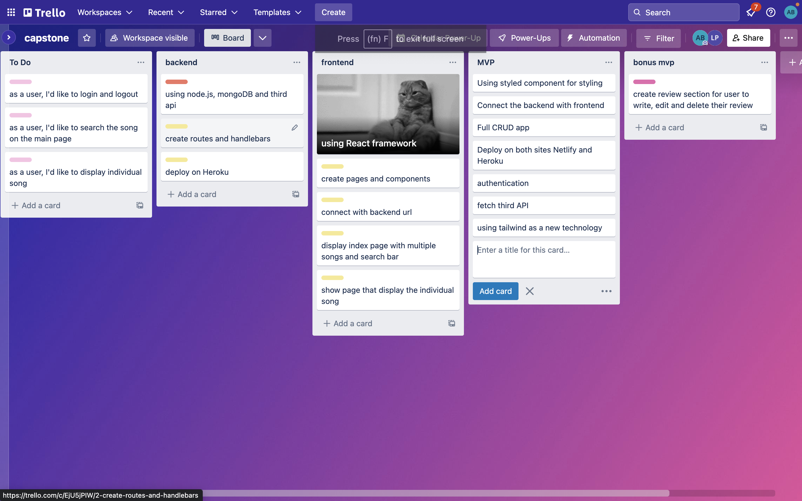
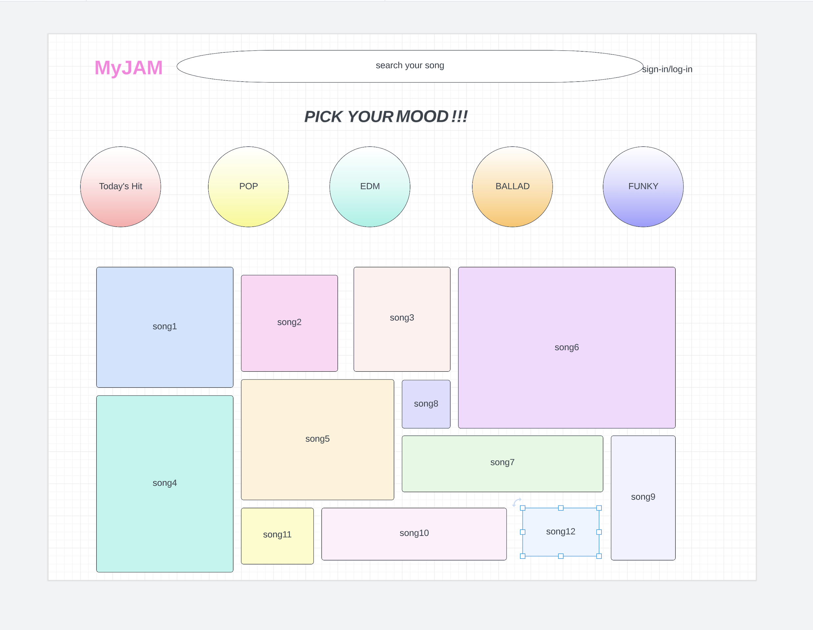
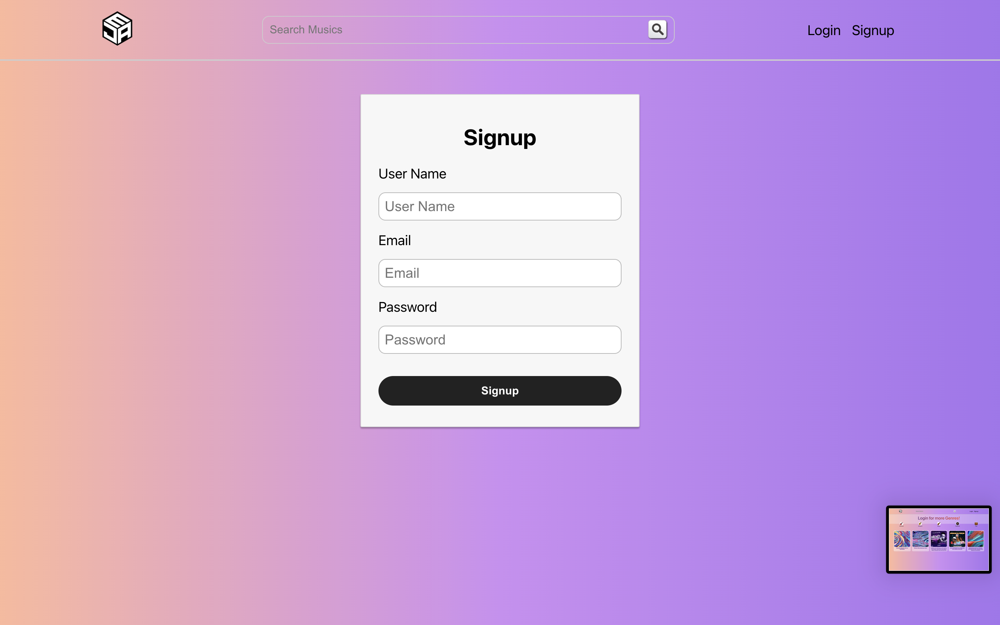
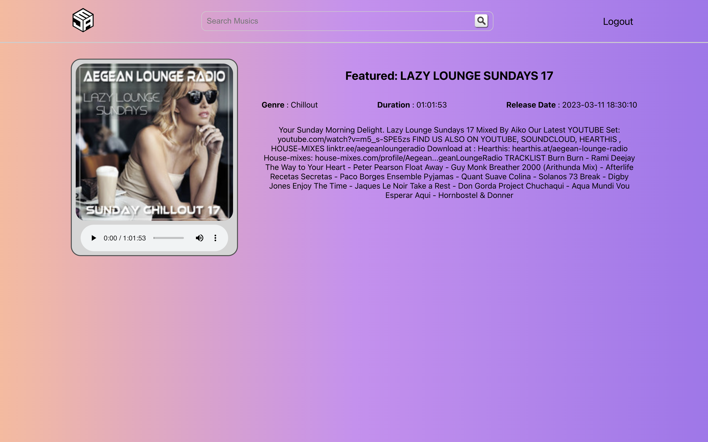

# myJAM app

this is an app to provide user music list/songs in several genres

## Repo
#### Frontend: [https://github.com/softbesta/MyJAM_Front.git](https://github.com/softbesta/MyJAM_Front.git)
#### Backend: [https://github.com/softbesta/MyJAM_Back.git](https://github.com/softbesta/MyJAM_Back.git)

### Trello

### Wireframe

### Interfaces

### Technologies Used

* Express
* React
* Tailwind 
* Rest API
* MongoDB/Mongoose
* Node
* JWT

## Live link

[https://welcometomyjam.netlify.app/](https://welcometomyjam.netlify.app/)
